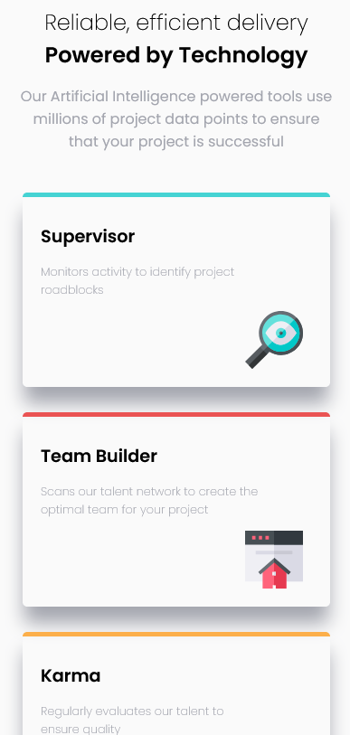
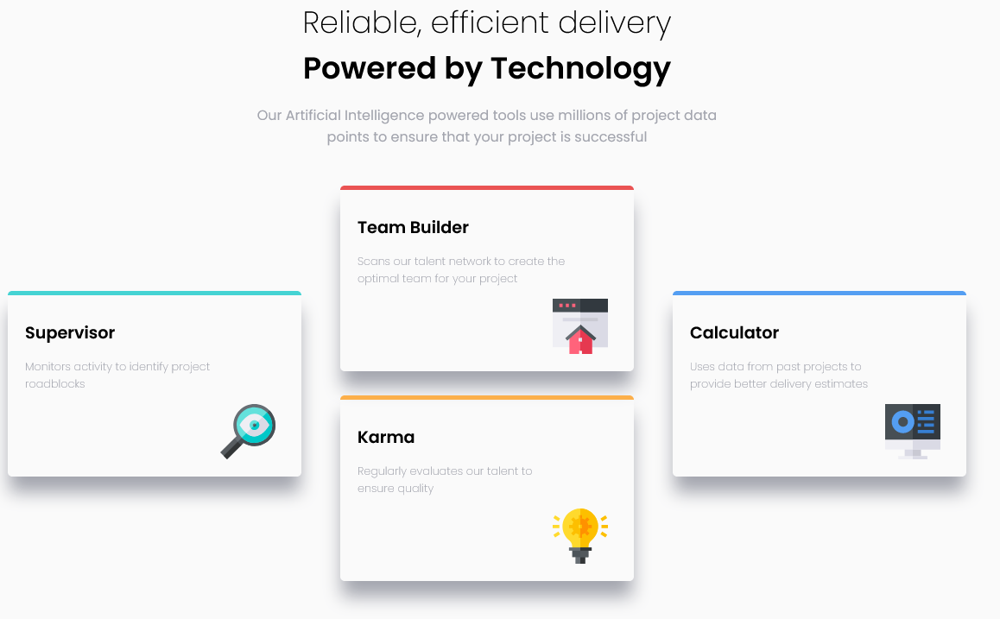

# Frontend Mentor - Four card feature section

## Welcome! 👋

Thanks for checking out this front-end coding challenge.

[Frontend Mentor](https://www.frontendmentor.io) challenges help you improve your coding skills by building realistic projects.

## The challenge

Users should be able to:

- View the optimal layout depending on their device's screen size

### Screenshot

### Links

- Solution URL: (https://github.com/giseleschaves/social-proof-section-master)
- Live Site URL: (https://giseleschaves.github.io/social-proof-section-master/)

## My process

- 1. check the difference between mobile and desktop to create the hmtl structure
- 2. upload fonts, identify colors and where they should be aplied
- 2. implemented the changes between desktop and mobile orientation of the flex boxes
- 3. styled each area

### Built with

- Semantic HTML5 markup
- CSS custom properties
- Flex box

### What I learned

- Practice more about flex box as the design requires distinct orientations for each part of the page
- It is always better to implement the flexibility of the containers before styling the content

### Continued development

Now I think I'm ready to move on and get more dificult challenges

### Useful resources

Thanks Kyle for this amazing tutorial about positioning

- Kyle from Web Dev Simplified - Learn Positioning (https://youtu.be/jx5jmI0UlXU)

## Author

- Frontend Mentor - @giseleschaves(https://www.frontendmentor.io/profile/giseleschaves)
- Twitter - @gisele_s_chaves(https://www.twitter.com/gisele_s_chaves)
